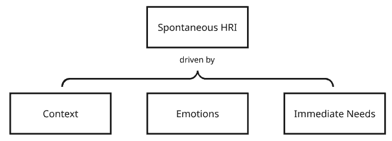

## Spontaneous Human-Robot Interaction: Embracing the Unplanned

When we think about human-robot interaction (HRI), we often imagine carefully designed scenarios: a robot assistant following a set routine, or a service robot responding to pre-defined commands. But real life is rarely so predictable. The true test—and opportunity—of HRI lies in the spontaneous, unplanned moments that emerge when humans and robots share space and purpose.

In my thesis, I proposed a definition of spontaneous HRI as as unplanned and ad-hoc exchanges typically driven by context, emotions, or immediate needs. The following figure drafts the concept.

### What is Spontaneous HRI?

Spontaneous human-robot interaction refers to those encounters that are not pre-scripted or scheduled. These are the moments when a person unexpectedly interacts with a robot, perhaps out of curiosity, necessity, or even by accident. Unlike planned interactions, spontaneity brings uncertainty, creativity, and a genuine test of a robot’s ability to adapt.

### Why Unplanned Interactions Matter

- **Reflect Real-World Complexity:** Most human interactions are unplanned. For robots to be truly useful and accepted, they must handle the unexpected—just as humans do.
- **Foster Trust and Engagement:** When robots respond gracefully to unplanned situations, people are more likely to trust and engage with them.
- **Drive Innovation:** Designing for spontaneity pushes the boundaries of robotics, requiring advances in perception, reasoning, and social intelligence.

### Challenges of Spontaneous HRI

- **Context Awareness:** Robots must quickly interpret new situations and understand human intentions without prior warning.
- **Flexibility:** Pre-programmed responses are not enough. Robots need adaptable behaviors and the ability to learn from new experiences.
- **Safety and Ethics:** Unplanned interactions can introduce risks. Ensuring safety and ethical behavior in unpredictable scenarios is critical.

### Designing for the Unplanned

To enable spontaneous HRI, designers and engineers must:

- Build robust perception systems that can handle ambiguity.
- Develop adaptive algorithms that allow robots to improvise.
- Create interfaces that invite and support unplanned engagement.

### Looking Ahead

As robots become more present in our daily lives, the ability to handle spontaneous, unplanned interactions will define their success. Embracing the unpredictable is not just a technical challenge. It’s a step toward more natural, meaningful relationships between humans and robots.

