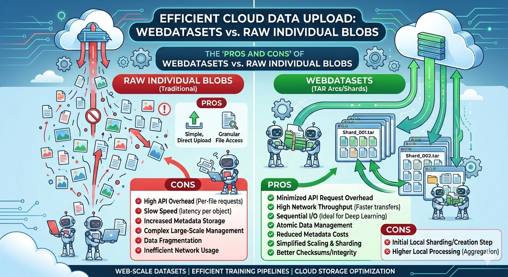

## The Trap

I had 10 million images ready for training. The model was written, the cloud bucket was empty, and all I had to do was upload. So I kicked off the transfer and went to grab a coffee. When I came back, the progress bar had barely moved.

The bottleneck was not bandwidth. It was API overhead. Every single file triggered its own PUT request, its own handshake, its own round-trip latency. Cloud object stores like S3, Azure Blob Storage, and GCS are built for large sequential I/O. Feed them millions of tiny objects and they will punish you with per-request overhead, metadata bloat, and sluggish listing operations.

This is the **small-file problem**, and if you work with large-scale datasets, you will run into it sooner or later.

## The Fix: Pack First, Upload Later

[WebDataset](https://github.com/webdataset/webdataset) flips the approach. Instead of treating each sample as a standalone cloud object, you pack thousands of them into TAR archive **shards**. Each shard is a single large blob typically between 100 MB and 1 GB.

Think of it as moving a library by the bookshelf instead of one page at a time.

## What You Actually Gain

### The API Call Tax Disappears

My 10 million images became roughly 10 thousand shards. That is a million-to-one reduction in API calls. Upload time went from days to hours, and the cloud bill dropped accordingly — most providers charge per request on top of storage.

### You Finally Saturate Your Bandwidth

Streaming a 1 GB shard lets TCP ramp up and stay at peak throughput. With individual small files, every request restarts the congestion window and you never get close to the connection's capacity. I measured a roughly 10x improvement on the same network link.

### Storage Gets Cheaper

Object stores charge metadata fees per object. Fewer objects means lower metadata overhead, faster bucket listings, and simpler lifecycle policies. It adds up quickly at scale.

### Training Becomes Streaming

PyTorch's `IterableDataset` pairs naturally with WebDataset shards. Data flows directly from cloud storage into the training loop, no need to stage the entire dataset on local disk first. On clusters where local NVMe is limited or expensive, this is a lifesaver.

### Multi-GPU Scaling Is Trivial

Distributing data across 8 GPUs or 64 nodes? Each worker reads a disjoint set of shards. No coordination server, no locking, no random-access contention. Scaling is literally splitting a list of URLs.

### One Checksum per Shard

Verifying data integrity across millions of loose files is painful. With shards, you checksum a few thousand archives and you are done. Replication and backup follow the same pattern.

### Shuffling Without Random Access

WebDataset supports shuffle buffers and shard-level randomization, which gives good-enough entropy for SGD without the cost of true random access across the entire store. In practice, this is the sweet spot. Raw blobs cannot match it without a full local cache.

## The Honest Trade-offs

- **Extra preprocessing step.** You have to pack your data into shards before uploading. The `webdataset` Python library and `tarp` CLI make this straightforward, but it is an additional stage in your pipeline.
- **No per-sample random access.** If your workflow needs to fetch arbitrary individual samples by key, raw blobs or a database are a better fit.
- **Shard size tuning.** The ideal shard size depends on your network, storage tier, and training batch size. A bit of experimentation is needed I found 256 MB to be a good starting point for most setups.

## Takeaway

If you are still uploading millions of individual files to the cloud for ML training, do yourself a favour: pack them into shards first. The one-time local preprocessing step pays for itself many times over in faster transfers, lower costs, and a training pipeline that just streams.
